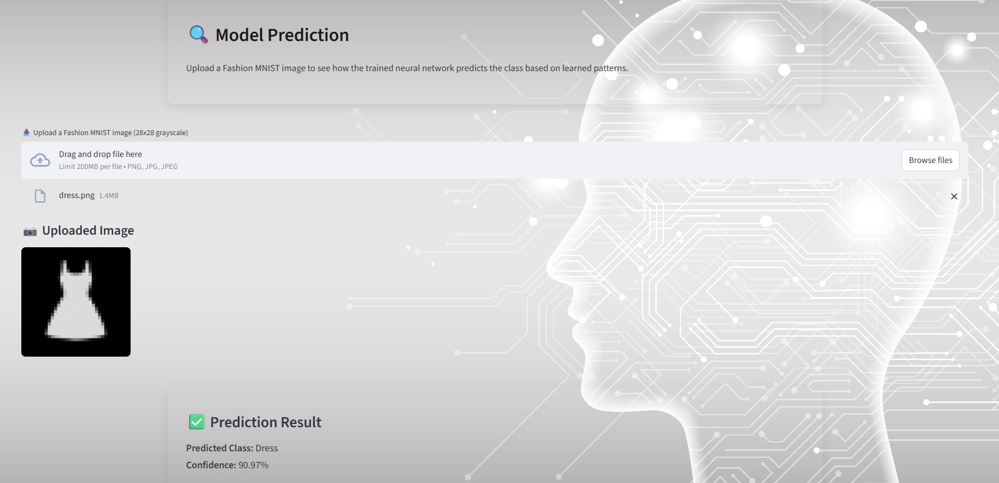

# Fashion -MNIST Neural Network Web Application
This project introduces core neural network concepts and allows user to predict clothing items from grayscale images. (images are attached in image directory for predictions)
The application explains neural networks fundamentals, architectures, key termonologies and provide prediction interface.
This project was developed as a learning project only.

# web app preview 

---

# features
- introduction to neural networks
- Types of neural networks
- Artifical neural networks (ANN) architecture
- key components and terminologies
- Image classification using training model

# Technologies used
Python
Tensorflow/keras
Streamlit
HTML/CSS

This is a learning project developed for educational purpose.
